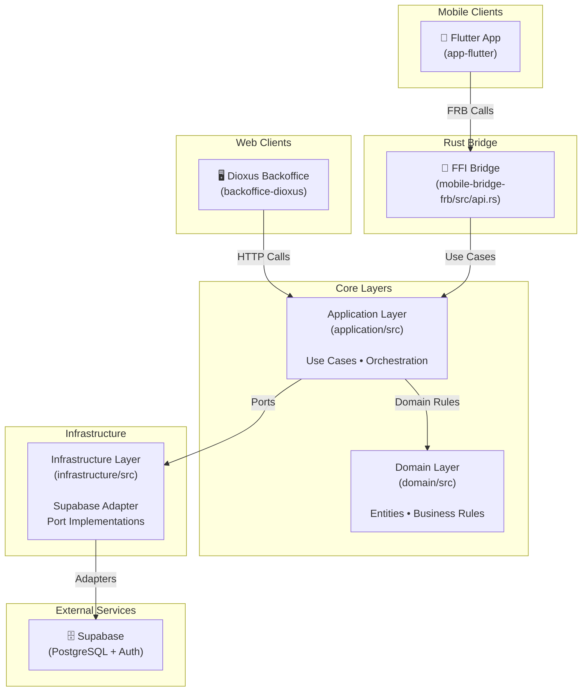
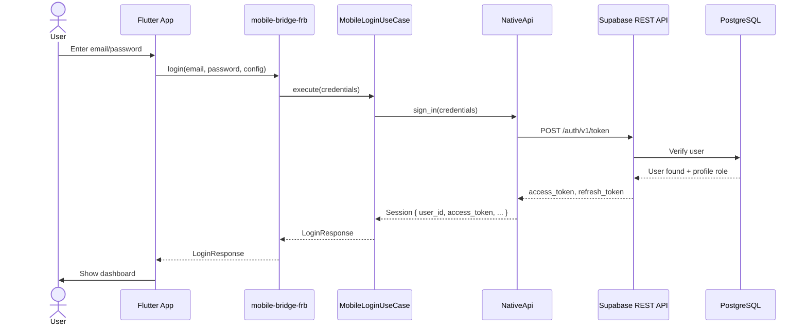
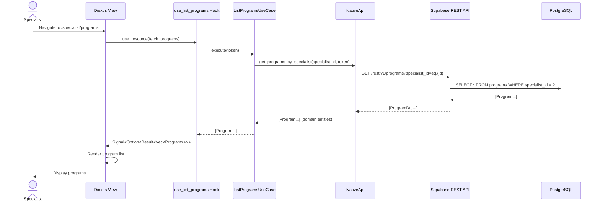

# Architecture

This document describes the architecture of **Eixe**, a physiotherapy clinic management system built with Rust (backend) and Flutter (mobile) / Dioxus (web).

## Overview

Eixe is a **Domain-Driven Design (DDD)** system using **Hexagonal Architecture** (ports and adapters). The codebase is organized into distinct layers that enforce separation of concerns:

- **Domain**: Pure business logic and entities
- **Application**: Use cases and orchestration
- **Infrastructure**: Adapters, persistence, external integrations
- **UI**: Flutter mobile app and Dioxus web backoffice

## Architecture Diagram



## Layer Descriptions

### Domain Layer (`domain/`)

The **heart of the system**. Contains all business logic and domain concepts.

**Responsibilities:**

- Define domain entities and value objects
- Enforce business invariants
- Model domain errors
- Aggregate roots and their rules

**Key Modules:**

- `entities.rs`: Domain entities (Program, Patient, Workout, Exercise, Session, etc.)
- `user.rs`: User abstraction
- `profile.rs`: User profile (Specialist or Patient)
- `session.rs`: Authentication session
- `credentials.rs`: Login credentials
- `role.rs`: User roles (Specialist, Patient)
- `email.rs`: Email value object
- `id.rs`: Identifier value objects
- `error.rs`: Domain errors and Result type

**Design Principles:**

- ✅ Domain is **framework-agnostic**
- ✅ No dependencies on UI or infrastructure
- ✅ Business rules encoded in types and constructors
- ✅ Immutable entities where possible

### Application Layer (`application/`)

**Orchestrates use cases** by composing domain and infrastructure.

**Responsibilities:**

- Implement use cases (application workflows)
- Define ports (trait abstractions)
- Orchestrate domain logic and adapters
- Handle cross-cutting concerns (security, validation)

**Key Components:**

#### Use Cases (`use_cases/`)

Each file represents a specific user workflow:

| Use Case                                                       | Purpose                                  |
| -------------------------------------------------------------- | ---------------------------------------- |
| `login.rs`                                                     | Authenticate specialist/patient          |
| `mobile_login.rs`                                              | Mobile-specific login (with Send bounds) |
| `get_patient_programs.rs`                                      | Retrieve assigned programs for patient   |
| `mobile_get_patient_programs.rs`                               | Mobile variant with Send bounds          |
| `submit_patient_workout_feedback.rs`                           | Log exercise effort/pain feedback        |
| `mobile_submit_patient_workout_feedback.rs`                    | Mobile variant                           |
| `assign_program_to_patient.rs`                                 | Specialist assigns program to patient    |
| `create_program.rs`, `create_workout.rs`, `create_exercise.rs` | Creation workflows                       |
| `patient_progress.rs`                                          | Analytics for specialist dashboard       |
| `agenda_schedule.rs`                                           | Agenda/calendar views                    |

**Use Case Pattern:**

```rust
pub struct UseCase<B: Backend> {
    backend: Arc<B>,
}

impl<B: Backend> UseCase<B> {
    pub fn new(backend: Arc<B>) -> Self { Self { backend } }
    pub async fn execute(&self, args: Args) -> Result<Output> { /* orchestration */ }
}
```

#### Ports (`ports/`)

Application **re-exports** domain repository traits and adds thin marker traits + blanket impls:

| Application marker       | Domain repository (source of truth) | Notes                                      |
| ------------------------ | ----------------------------------- | ------------------------------------------ |
| `SpecialistDataProvider` | `SpecialistCatalogReadRepository`   | Backoffice reads                           |
| `SpecialistDataMutator`  | `SpecialistCatalogWriteRepository`  | Backoffice writes                          |
| `PatientDataProvider`    | `SpecialistCatalogReadRepository`   | Mobile reads (same contract, `Send` stack) |
| `PatientDataMutator`     | `PatientSessionWriteRepository`     | Mobile session / feedback writes           |

`Backend` / `MobileBackend` unify markers for use-case generics (blanket impls in `ports/mod.rs`).

#### Backend Trait

```rust
pub trait Backend: SpecialistDataMutator + SpecialistDataProvider + Send + Sync {}
pub trait MobileBackend: PatientDataProvider + PatientDataMutator + Send + Sync {}
```

Unifies ports into a single dependency for use cases.

### Infrastructure Layer (`infrastructure/`)

**Implements ports** with concrete adapters and external integrations.

**Responsibilities:**

- Map domain models to storage (DTO serialization)
- Implement authentication
- Query and persist data
- Integrate external services

**Key Components:**

#### Supabase Adapter (`supabase/`)

Domain repository traits are implemented by **`SupabaseRestRepository`** in `repositories/supabase_rest_repository.rs` (REST + RPC). `Api` and `NativeApi` are type aliases to that type; builders live in `api.rs` and `native_api.rs`. DTOs remain in `infrastructure/src/api/dtos.rs`.

| Module          | Purpose                                |
| --------------- | -------------------------------------- |
| `client.rs`     | HTTP client for Supabase REST API      |
| `config.rs`     | Configuration (URL, anon key)          |
| `repositories/` | `SupabaseRestRepository` (trait impls) |
| `api.rs`        | `Api` alias + `ApiBuilder`             |
| `native_api.rs` | `NativeApi` alias + `NativeApiBuilder` |

**RPC example:** migration `014_rpc_session_feedback_by_patient_program.sql` exposes `list_session_exercise_feedback_for_patient_program` so the app loads program-wide feedback in one call instead of two round-trips.

#### Database Schema (`../supabase/migrations/`)

PostgreSQL schema defined as versioned migrations:

- `001_initial_schema.sql`: Core tables (users, profiles, programs, workouts, exercises)
- `002_*.sql`: Incremental updates

**Core Tables:**

```
auth.users ───┬─→ public.profiles (user_id, role)
              │
              ├─→ public.specialist_patients (specialist_id, patient_id)
              │
              └─→ public.patient_programs (program_id, patient_id)
                  └─→ public.workout_sessions (feedback, completion)
                      └─→ public.session_exercise_feedback (effort, pain)

public.programs ───→ public.program_schedules ───→ public.workouts
public.workouts ───→ public.workout_exercises ───→ public.exercises
```

### Bridge Layer (`mobile-bridge-frb/`)

**FFI (Foreign Function Interface)** exposing Rust to Flutter.

**Generated by `flutter_rust_bridge`**, this crate bridges Rust and Dart via:

- C FFI bindings
- Serialization/deserialization (serde)
- Async channel support

**Entrypoint: `src/api.rs`**

Public async functions callable from Flutter:

```rust
// Authentication
pub async fn login(request: LoginRequest, config: BridgeConfig) -> Result<LoginResponse, String>
pub async fn refresh_session(refresh_token: String, config: BridgeConfig) -> Result<LoginResponse, String>

// Data Fetching
pub async fn get_patient_programs(token: String, config: BridgeConfig) -> Result<Vec<PatientProgramSummary>, String>

// Data Submission
pub async fn submit_day_feedback(token: String, request: SubmitDayFeedbackRequest, config: BridgeConfig) -> Result<(), String>
pub async fn update_day_completion(token: String, request: UpdateDayCompletionRequest, config: BridgeConfig) -> Result<(), String>
```

**Data Structures:**

- `BridgeConfig`: Supabase URL + anon_key (configured at runtime)
- `LoginRequest`: email + password
- `LoginResponse`: access_token, user_id, user_profile_type
- `PatientProgramSummary`: Program details with days and exercises
- `SubmitDayFeedbackRequest`: Workout feedback (effort, pain, comments)

**Key Pattern:**

1. Receive Flutter request
2. Instantiate `NativeApi` with config
3. Create use case (e.g., `MobileLoginUseCase<NativeApi>`)
4. Execute use case and map domain result to Dart-friendly DTO
5. Return `Result<T, String>` (Dart cannot represent Rust error enums)

## UI Layers

### Flutter Mobile (`app-flutter/`)

**Mobile frontoffice** for patients and specialists.

**Architecture:**

- **Pages** (container widgets): Handle navigation and page state
- **Widgets** (presentation): Dumb UI components, no logic
- **Pages** call Rust bridge functions directly via generated bindings
- **FutureBuilder/StreamBuilder**: Handle async bridge calls

**Key Entry Point:** `lib/main.rs`

```dart
void main() {
  runApp(EixeApp(bridgeConfig: BridgeRuntimeConfig.fromEnvironment()));
}
```

**Design:**

- All business logic in Rust
- Flutter is purely UI/UX
- No Dart-side repositories or use cases
- Error messages sourced from Rust via bridge

**Localization:** Supports English (en), Spanish (es), Galician (gl) via `l10n/app_*.arb`

### Dioxus Backoffice (`backoffice-dioxus/`)

**Web backoffice** for specialist management.

**Architecture:**

- **Views** (container components): Pages with routing
- **Hooks** (custom): Wrapper around use cases
- **Components** (presentation): Reusable UI elements
- **app_context.rs**: Dependency container, injects `Backend` into hooks

**Key Entry Point:** `src/main.rs`

```rust
fn main() {
    backoffice_dioxus::launch();
}
```

Calls `backoffice_dioxus::lib.rs`:

```rust
pub fn launch() {
    init_logging();
    dioxus::launch(App);  // Start router and render App component
}
```

**Routing:**

```rust
#[derive(Routable, Clone, PartialEq)]
pub enum Route {
    #[route("/")] LoginView {},
    #[route("/specialist")] SpecialistPatients {},
    #[route("/specialist/programs")] SpecialistPrograms {},
    #[route("/specialist/exercises")] ExerciseLibrary {},
    #[route("/specialist/workouts")] WorkoutLibrary {},
    #[route("/specialist/workouts/:id")] WorkoutEditor { id: String },
    #[route("/specialist/patient/:id")] PatientProgress { id: String },
    #[route("/patient/program/:patient_program_id/day/:day_index")] PatientWorkoutSessionView { ... },
    #[route("/programs/:id/edit")] ProgramEditor { id: String },
}
```

**Use Case Example: Fetching Programs**

1. `WorkoutLibrary` view calls `use_workout_library()` hook
2. Hook calls `ListWorkoutLibrary::execute()`
3. Use case orchestrates `backend.get_workouts()`
4. `NativeApi` (Supabase adapter) fetches from DB
5. Result bubbles back to component via Dioxus signal

## Data Flow Examples

### Sequence 1: Mobile Patient Login



### Sequence 2: Specialist Fetches Programs (Dioxus Web)



## Dependency Injection

### Web (Dioxus)

```rust
// backoffice-dioxus/src/app_context.rs
pub fn build_app_context() -> Arc<impl Backend> {
    let config = SupabaseConfig::from_env();
    let client = SupabaseClient::new(config);
    let api = NativeApi::new(client);
    Arc::new(api)
}
```

Injected into app as a context provider; hooks extract it via `use_context()`.

### Mobile (Flutter)

```rust
// mobile-bridge-frb/src/api.rs
fn backend(config: BridgeConfig) -> Arc<NativeApi> {
    let config = SupabaseConfig {
        url: config.url,
        anon_key: config.anon_key,
    };
    Arc::new(NativeApi::new(SupabaseClient::new(config)))
}
```

Config passed at call time from Flutter; backend instantiated per request (simple and safe for FFI).

## Key Design Decisions

### 1. DDD Boundaries by Crate

```
domain/              → Business logic (framework-agnostic)
application/         → Use cases + ports (orchestration)
infrastructure/      → Adapters (Supabase REST)
mobile-bridge-frb/   → FFI bridge (Dart calling Rust)
app-flutter/         → Mobile UI (pure presentation)
backoffice-dioxus/   → Web UI (pure presentation)
```

**Benefit:** Clear separation; infrastructure cannot leak into domain.

### 2. Ports for Abstraction

Instead of direct database calls, use cases depend on traits:

- `AuthService` → Supabase auth
- `DataProvider` → Supabase queries
- `DataMutator` → Supabase mutations

**Benefit:** Easy to mock or swap adapters without touching use cases.

### 3. Send-Bounded Variants for Mobile

Mobile use cases (`MobileLoginUseCase`, `MobileGetPatientProgramsUseCase`) require `Send` bounds because:

- Flutter's Rust bridge runs async calls on a thread pool
- Domain futures must be `Send`
- Dioxus (web) doesn't need this; it runs single-threaded

**Benefit:** No unnecessary `Send` overhead on web; optimal for each platform.

### 4. DTOs for Serialization

Domain entities (e.g., `Program`, `Exercise`) differ from Supabase rows (`ProgramDto`, `ExerciseDto`):

- Domains are type-safe, immutable, validate invariants
- DTOs are flattened, nullable for JSON serialization
- Adapter maps DTO → Domain on retrieval, Domain → DTO on persistence

**Benefit:** Decouples domain model from storage schema.

### 5. Error Handling

Domain errors are `enum` with context:

```rust
pub enum DomainError {
    NotFound(String),
    Unauthorized,
    InvalidInput(String),
    // ...
}
```

When crossing the FFI boundary, errors convert to `String` (Dart cannot represent Rust enums):

```rust
pub async fn login(...) -> Result<LoginResponse, String> {
    use_case.execute(...).await.map_err(|e| e.to_string())
}
```

**Benefit:** Rich error info in Rust; simple JSON string in mobile UI.

## Testing Strategy

### Domain Testing

Pure Rust tests; no external dependencies required.

### Application Testing

Mock `Backend` trait; test orchestration logic.

### Integration Testing

Run against real Supabase instance; test end-to-end flows.

### UI Testing (Flutter)

Widget tests mock Rust bridge; integration tests use real bridge with test server.

## Deployment

### Mobile

1. Build Rust bridge: `cargo build --release` (generates `.so` for Android, `.a` for iOS)
2. Flutter build: `flutter build apk` / `flutter build ios`
3. Distribute via Play Store or TestFlight

### Web (Dioxus)

1. Build: `dx build --release`
2. Serve static files
3. Or: embed in a Tauri/Electron app

### Backend (Supabase)

1. Migrations applied via `supabase db push`
2. Hosted on Supabase infrastructure
3. RLS policies enforce row-level security

## Crate Dependencies

```
backoffice-dioxus
├── application
│   ├── domain
│   └── infrastructure
│       ├── domain
│       └── application (for trait impls)
│
mobile-bridge-frb
├── application
│   ├── domain
│   └── infrastructure
│       ├── domain
│       └── application
│
app-flutter
└── mobile-bridge-frb (generated bindings)
```

**Invariant:** Domain has zero external dependencies (except std).

## Extending the System

### Adding a New Use Case

1. **Define** in `application/src/use_cases/your_use_case.rs`
2. **Depend on** `Backend` trait (or `MobileBackend` for mobile)
3. **Implement ports** in `infrastructure/src/supabase/native_api.rs` if needed
4. **Call from UI:**
   - Dioxus: Create hook in `backoffice-dioxus/src/hooks/`, call use case
   - Flutter: Expose in `mobile-bridge-frb/src/api.rs`, generate bindings, call from Dart

### Adding a New Port

1. **Define trait** in `application/src/ports/your_port.rs`
2. **Implement** in `infrastructure/src/supabase/native_api.rs`
3. **Use cases** depend on trait, not concrete type

### Schema Changes

1. **Create migration** in `supabase/migrations/NNN_*.sql`
2. **Update DTOs** in `infrastructure/src/api/dtos.rs` if needed
3. **Update domain entities** in `domain/src/entities.rs` if business logic changes
4. **Update use cases** to work with new domain entities

---

**Last Updated:** 2026-03-18

For more information, see the project README and individual module documentation.
