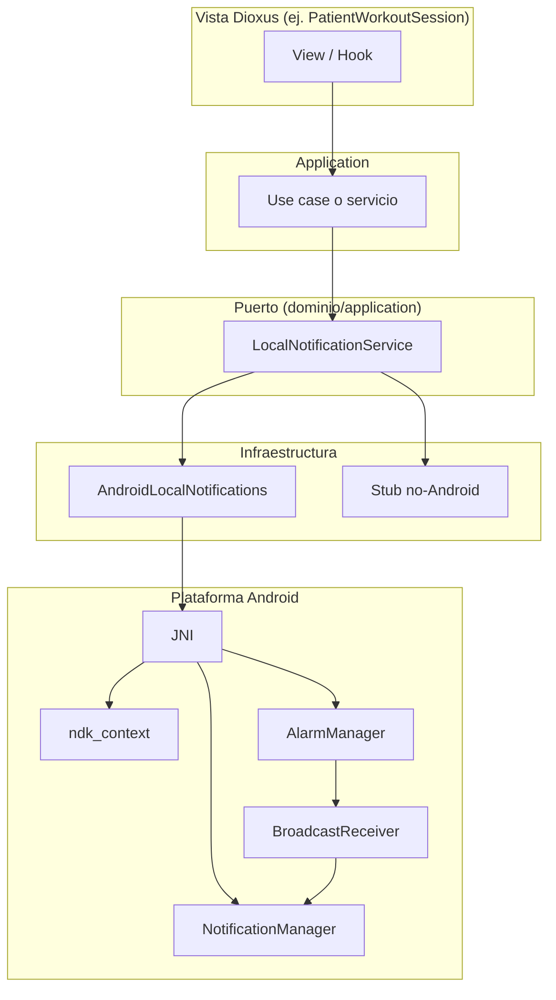

# Plan: Notificaciones push locales en app Android (Dioxus)

## Contexto técnico

- **Proyecto**: App Dioxus 0.7 con feature `mobile`, ya se ejecuta en Android con `dx serve --platform android` y `android_logger` en [main.rs](src/main.rs).
- **Dependencias Android ya presentes**: El árbol de dependencias incluye `jni`, `ndk` y **ndk-context** (vía `dioxus-asset-resolver`). No hace falta añadir un crate nuevo solo para JNI/contexto.
- **Práctica habitual en Android**: Notificaciones locales = `NotificationManager` + `NotificationChannel` (API 26+). Para **programar** en el tiempo: `AlarmManager` + `BroadcastReceiver` (o `WorkManager`); en Android 13+ hace falta el permiso runtime `POST_NOTIFICATIONS`.

No existe un crate Rust estándar tipo “local notifications” para Dioxus/Android. Las opciones son: **tauri-plugin-notifications** (atado a Tauri), **jni_notifications** (zoff99, GPL-3.0, referencia útil), o **implementación propia** con JNI. Lo más alineado con el proyecto actual es una capa propia que use el contexto ya expuesto por el ecosistema Dioxus.

---

## Objetivo de arquitectura

- **Dominio**: Definir un puerto (trait) para “notificaciones locales” independiente de la plataforma.
- **Infraestructura**: Implementar ese puerto en Android vía JNI usando `ndk-context` + `jni`; en web/desktop, implementación vacía o stub.
- **App**: Usar el puerto desde casos de uso o hooks (por ejemplo recordatorios de workout) sin conocer detalles de Android.

---

## 1. Abstracción en dominio (puerto)

- **Ubicación**: Nuevo módulo en dominio o en `application` (puerto de salida), por ejemplo `domain::ports::LocalNotifications` o `application::ports::LocalNotificationService`.
- **Trait** (ejemplo de API):
  - `show_now(&self, id: &str, title: &str, body: &str) -> Result<(), DomainError>`  
    Para mostrar una notificación inmediata.
  - `schedule_at(&self, id: &str, title: &str, body: &str, at: DateTime<Utc>) -> Result<(), DomainError>`  
    Para programar una notificación (solo tendrá efecto real en Android).
- **Tipos**: Identificador de notificación opaco (p. ej. `String` o tipo nuevo), títulos/cuerpos como `str`; fechas con `chrono` ya usado en el proyecto.
- No incluir detalles de canales, íconos ni prioridad en el trait; eso queda en la implementación Android.

---

## 2. Implementación Android (JNI + ndk-context)

- **Condición de compilación**: Código bajo `#[cfg(target_os = "android")]` y dependencias opcionales para `jni`/`ndk-context` si no se reutilizan las que ya trae Dioxus.
- **Contexto**: Usar `ndk_context::android_context()` para obtener `JavaVM` y el puntero a `Context` (como en [docs.rs/ndk_context](https://docs.rs/ndk-context/latest/ndk_context/)); con `jni` obtener `JNIEnv` y el objeto `Context` (p. ej. `JObject::from_raw(ctx.context() as *mut _)`).
- **Mostrar ya**:
  - Vía JNI: obtener `NotificationManager` desde `Context.getSystemService(NOTIFICATION_SERVICE)`.
  - Crear `NotificationChannel` (API 26+) con importancia/prioridad adecuada.
  - Construir `Notification` (Builder) con título, texto y channel id; llamar `NotificationManager.notify(id_hash, notification)`.
  - Manejar errores y permisos: comprobar que el permiso `POST_NOTIFICATIONS` esté concedido (API 33+) antes de notificar.
- **Programar** (recordatorio en un momento dado):
  - Opción A (recomendada para “prácticas habituales”): **AlarmManager + BroadcastReceiver**.
    - En **Kotlin/Java**: clase que extienda `BroadcastReceiver`, que al recibir el `Intent` muestre la notificación (usando el mismo canal y lógica que “show now”). El receiver debe estar registrado en el `AndroidManifest` y el `PendingIntent` debe crearse con el mismo contexto/package.
    - Desde **Rust**: vía JNI, obtener `AlarmManager`, crear `PendingIntent` (con `Intent` hacia el receiver y extras para id/title/body), y llamar `setExactAndAllowWhileIdle` o `setAlarmClock` según versión y política de ahorro de batería.
    - Requiere que el proyecto Android generado por Dioxus incluya nuestro receiver y el permiso; ver punto 4.
  - Opción B: Solo “show now” desde Rust; la programación se hace en la capa de aplicación (p. ej. al abrir la app o con un timer en primer plano). No cubre recordatorios con app cerrada.
- **Ubicación del código**: Por ejemplo `src/infrastructure/android/notifications.rs` (o `src/infrastructure/platform/android/`) con el trait implementado para un tipo `AndroidLocalNotifications` que guarde lo mínimo necesario (o nada si siempre se usa `ndk_context` en el momento del uso).

---

## 3. Integración en la app (contexto e inyección)

- **AppContext**: Añadir al [AppContext](src/infrastructure/app_context.rs) un campo opcional para el puerto de notificaciones, por ejemplo `local_notifications: Option<Arc<dyn LocalNotificationService>>`. En [context.rs](src/context.rs), en builds Android construir la implementación Android y pasarla; en web/desktop pasar `None` o un stub que no haga nada.
- **Uso**: Desde un caso de uso o hook (p. ej. “programar recordatorio de workout”), obtener el servicio del contexto; si es `Some`, llamar `schedule_at` o `show_now`; si es `None`, no hacer nada (o log). Así la UI y la lógica de negocio no dependen de la plataforma.

---

## 4. Proyecto Android generado por Dioxus (Kotlin y permisos)

- **Limitación**: El proyecto Android lo genera el CLI `dx` (WRY/Dioxus). No está documentado en la investigación si existe un punto de extensión oficial para añadir fuentes Kotlin/Java propias sin tocar el generado.
- **Verificación necesaria** (antes de implementar el receiver):
  - Ejecutar `dx bundle --platform android` (o equivalente) y localizar el directorio del proyecto Android (p. ej. bajo `target/` o en la documentación de Dioxus 0.7).
  - Comprobar si existe algo tipo `WRY_ANDROID_KOTLIN_FILES_OUT_DIR` o un “custom source set” donde copiar nuestra clase Kotlin/Java del `BroadcastReceiver`.
  - Revisar [Dioxus.toml](Dioxus.toml) y la documentación de Dioxus 0.7 para **AndroidManifest** y permisos: añadir `<uses-permission android:name="android.permission.POST_NOTIFICATIONS" />` y, si hace falta, solicitud en runtime (desde Kotlin/Java o vía JNI desde Rust).
- **Si no se puede inyectar Kotlin de forma estable**: Implementar solo `show_now` en Rust vía JNI; la programación se puede dejar para una fase posterior o restringir a “cuando la app está abierta” con timers en Rust.

---

## 5. Permisos y canal (Android)

- **Manifest**: Permiso `POST_NOTIFICATIONS` (Android 13+). Comprobar si el manifest generado por Dioxus puede extenderse por configuración (Dioxus.toml) o si hay que documentar un paso manual/patch.
- **Runtime**: Antes de la primera notificación en Android 13+, solicitar el permiso (Activity o Context); puede hacerse desde Kotlin (en una Activity que ya tenga el contexto) o exponiendo una función JNI que llame a `Activity.requestPermissions` / equivalente.
- **Canal**: Crear un canal (p. ej. “recordatorios” o “workouts”) con importancia por defecto y registrarlo una vez (por ejemplo en el primer uso de notificaciones o en un init específico de Android).

---

## 6. Referencias y buenas prácticas

- **Android**: [NotificationManager](https://developer.android.com/reference/android/app/NotificationManager), [NotificationChannel](https://developer.android.com/reference/android/app/NotificationChannel), [AlarmManager](https://developer.android.com/reference/android/app/AlarmManager), [BroadcastReceiver](https://developer.android.com/reference/android/content/BroadcastReceiver); para precisión y Doze, `setExactAndAllowWhileIdle` / `setAlarmClock`.
- **Rust**: Uso de [ndk_context::android_context()](https://docs.rs/ndk-context/latest/ndk_context/fn.android_context.html) y [jni](https://docs.rs/jni/) para llamadas desde Rust; el ejemplo en la documentación de `AndroidContext` con `getSystemService` es el patrón a seguir.
- **Proyectos de referencia**: [jni_notifications](https://github.com/zoff99/jni_notifications) (GPL) para ver estructura Rust + Kotlin; [tauri-plugin-notifications](https://lib.rs/crates/tauri-plugin-notifications) para diseño de API (canales, programación).

---

## Orden sugerido de tareas

1. **Definir el puerto** en dominio/application (trait + tipos) y la implementación stub para no-Android.
2. **Implementar `show_now` en Android** con ndk-context + jni (canal, permiso, NotificationManager).
3. **Integrar en AppContext** y probar una notificación inmediata desde la app (p. ej. desde un botón en la vista de workout).
4. **Verificar estructura del proyecto Android** generado por `dx` y si se pueden añadir clases Kotlin/Java.
5. Si es posible inyectar Kotlin: **añadir BroadcastReceiver y lógica de programación**; desde Rust, **implementar `schedule_at`** con AlarmManager + PendingIntent; si no, documentar limitación y dejar solo `show_now`.
6. **Añadir y documentar** permisos en manifest y solicitud en runtime (POST_NOTIFICATIONS) según la forma que permita Dioxus.

---

## Diagrama de capas

Este plan deja la puerta abierta a notificaciones remotas (FCM) en el futuro manteniendo el mismo puerto de “mostrar/programar” a nivel de aplicación.
